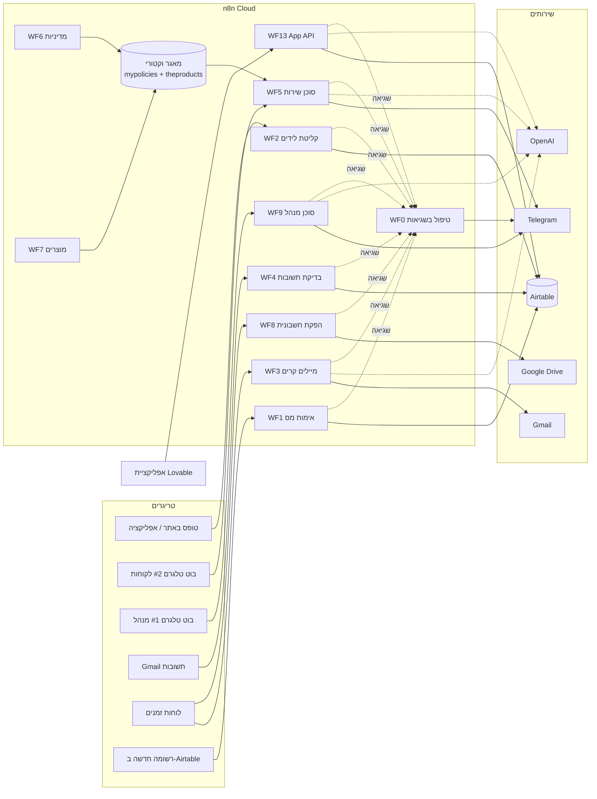

# ארכיטקטורה — Chen ERP

## התמונה הגדולה



## שלוש שכבות

| שכבה | טכנולוגיה | מה יש בה |
|---|---|---|
| נתונים | Airtable | 4 טבלאות. מקור האמת היחיד. מפתחות זרים כטקסט (`CUST-0001`). |
| לוגיקה | n8n Cloud | 10 workflows + Error Handler, 3 סוכני AI, מאגר וקטורי בזיכרון. אפס קוד. |
| ממשק | Lovable | דשבורד, טבלאות, טפסים, צ'אט. מדבר רק עם WF13. |

## שלושת הסוכנים

| סוכן | ערוץ | מקור הידע | מה מותר לו |
|---|---|---|---|
| שירות לקוחות (WF5) | טלגרם #2, פתוח ללקוחות | RAG: מדיניות + מוצרים | לענות רק ממה שנשלף. לא להבטיח, לא להמציא, להעביר לנציג כשלא בטוח. זיכרון שיחה לפי chat id. |
| מנהל (WF9) | טלגרם #1, Chat ID של הבעלים בלבד | סיכום חשבוניות שחושב מראש ב-Summarize | קריאה בלבד. מקבל מספרים מוכנים ורק מנסח. |
| מכירות (WF3+WF4) | Gmail, מתוזמן | שדות הליד + פלייבוק בפרומפט | לכתוב מייל אחד לליד אחד בכל ריצה. |

## RAG בשלושה שלבים

1. **הכנה** (WF6, WF7, ידני): מסמכי המדיניות ו-CSV המוצרים נחתכים לקטעים, כל קטע הופך לווקטור (`text-embedding-3-small`) ונשמר במאגר בזיכרון תחת מפתח (`mypolicies`, `theproducts`).
2. **שליפה**: שאלת הלקוח הופכת לווקטור; הסוכן קורא לכלי `policies` או `products` ומקבל את 5 הקטעים הדומים ביותר.
3. **תשובה**: הקטעים נכנסים להקשר של המודל, שעונה רק על בסיסם.

למה לא רק פרומפט ארוך? כי המדיניות + הקטלוג הם ~100K תווים, משתנים, ורוצים שהסוכן יצטט ולא ידמיין.

## מחזור חיים של חשבונית

```
אפליקציה / Airtable: רשומה חדשה (Amount, CustomerId)
  → WF1 (פולינג כל דקה על Created)
      ├─ לא תקין → Status = Invalid
      └─ תקין → VatAmount, Total, InvoiceNumber עוקב → Status = Ready
  → WF8 (כל דקה, Ready ובלי PdfUrl)
      → HTML עברית RTL → קובץ → Google Drive → PdfUrl, Status = Issued
  → הבעלים מסמן Paid (באפליקציה, דרך WF13 update)
```

## מחזור חיים של ליד

```
POST /webhook/lead → WF2: כפילות? → Status = New
  → WF3 (כל 3 שעות, ליד אחד): מייל קר → Contacted   (נכשל → EmailFailed)
  → WF4 (כל 30 דק'): תשובה במייל מאותה כתובת → Replied + התראת טלגרם לבעלים
```

## טיפול בשגיאות (דרישת הקורס: לפחות אחד בכל אוטומציה)

- **גלובלי**: WF0 מוגדר כ-Error Workflow בכל ה-workflows. כל ריצה אדומה → הודעת טלגרם לבעלים עם שם ה-workflow, הצומת, השגיאה וקישור.
- **מקומי**, בתוך כל workflow: ענף Invalid (WF1), תשובת 400 ו-Continue on error (WF2), ענף error של Gmail → EmailFailed (WF3), מייל ללא ליד (WF4), fallback ללקוח (WF5), Unauthorized + fallback (WF9), Fallback output ב-Switch + תשובת שגיאה בצ'אט (WF13).

## אבטחה במינימום הנדרש

- ה-PAT של Airtable, מפתח OpenAI וטוקני הטלגרם חיים רק ב-Credentials של n8n.
- האפליקציה לא מחזיקה שום מפתח: היא קוראת ל-webhook אחד, ו-n8n אוכף את הכללים.
- בוט המנהל חסום ל-Chat ID אחד.
- ריפו הגיט מכיל placeholders במקום מזהים, ושום סוד.
